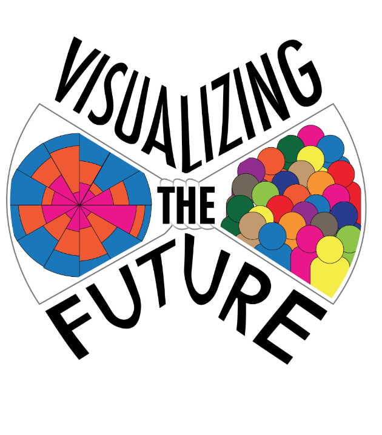

  

__What does a design process look like that acknowledges, from the beginning, that all digital platforms are ephemeral?__ What is the core conceptual labor at work in a digital repository, how might anticipating the broader lifespan of those ideas and labor help guide a development process? This case study follows the development of a repository of exemplary data visualization resources for library-based instruction.

__Visualizing the Future__ is an [IMLS National Forum](https://www.imls.gov/grants/available/national-leadership-grants-libraries) grant project to develop a literacy-based instructional and research agenda for library and information professionals with the aim to create a community of praxis focused on data visualization. As part of the National Forum, [several fellows](https://visualizingthefuture.github.io/fellows/) began working on building resources to support librarians in developing data visualization pedagogy. The Examples working group elected to develop a digital repository to host exemplary data visualizations and datasets for instructor use across a variety of contexts.

### Browse the Collection

<!-->

--->


