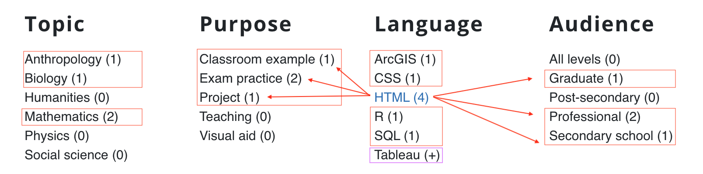

**Summary**
The beta version of this website comprises a set of objects, each of which is includes images, data, and descriptions. The collection items in this demo are providedby the [Clark Data Labs](https://clarkdatalabs.github.io) at the University of Michigan and the [Visualizing the Future](https://visualizingthefuture.github.io/) Fellowship community.

**Search**
Currently, the site is comprised of two overarching object types: data visualizations and data sets. By clicking the "Search" tab, one may navigate through all visualizations or examples. This is most useful if one knows the name of the data set or visualization they are searching for, or some other qualifying information. A few examples would be searching by title, programming language, audience level, or topic (i.e. mathematics, biology, economics).

**Browse**
By navigating to the "Browse" tab, one can filter results by either visualization or by data set. All data sets on the website house downloadable CSVs or a link to where a CSV may be found. <em>All</em> examples include author, source, topic, short description, etc.[^1]

Furthermore, the "Browse" section includes a variety of faceting tools. One can sort alphabetically or incorporate multiple facets into their search. For example, by clicking on "HTML" in the data visualization browse tab, one can then see that examples tagged as "HTML" visualizations cover topics in anthropology, biology, or mathematics, and purposes of classroom example, exam practice, or project Of course, HTML isn't a platform used to create visualizations, this is only a beta version. Clicking values with numbers (i.e., (2)) next to their name narrows the search, and clicking values with + (i.e., (+) widens the search).[^2]

  

---
### Notes

[^1]: Integer eu augue elementum, venenatis nisi vitae, ultrices magna. Nunc accumsan sem quis tristique iaculis. Quisque sed lorem tortor.

[^2]: Nunc semper commodo fringilla. Proin eget metus eget felis faucibus aliquet. Cras ultrices turpis id nibh cursus fringilla. Aenean nec magna turpis. Suspendisse egestas tellus iaculis ante pharetra imperdiet ac at odio.